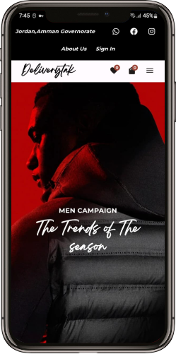
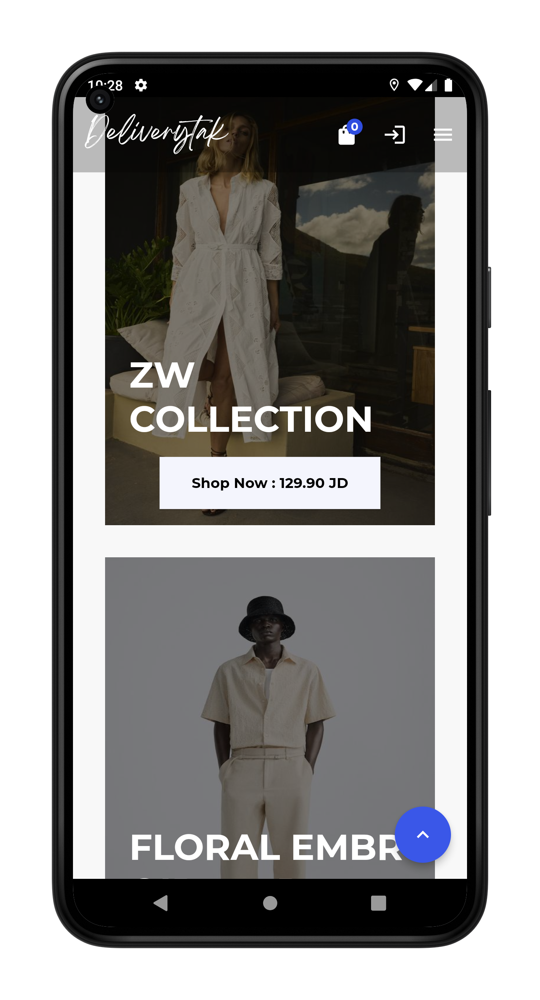
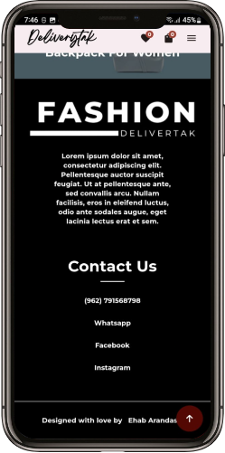
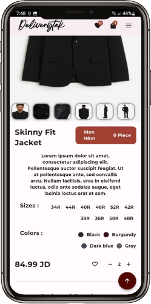
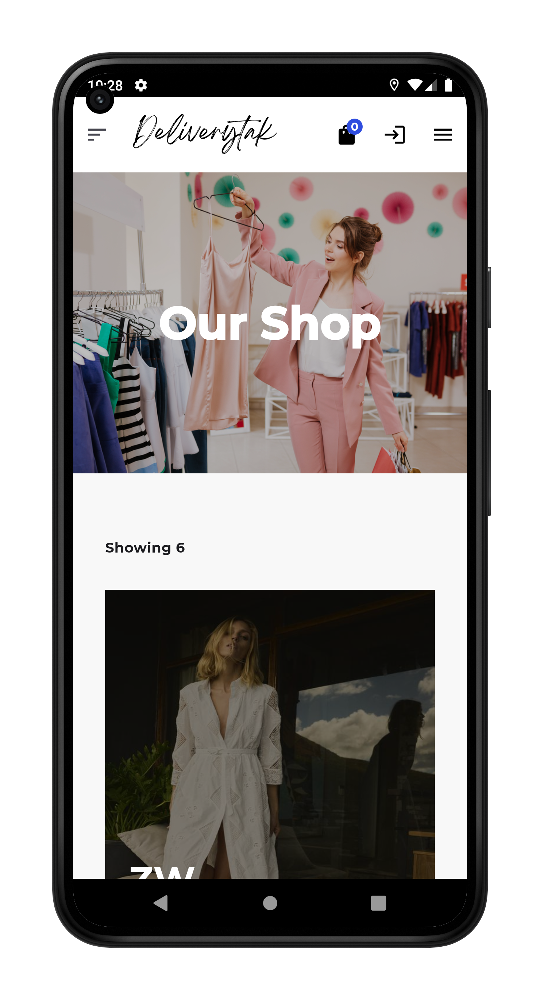
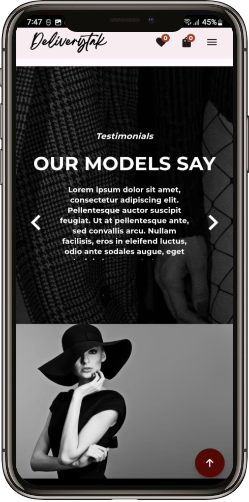
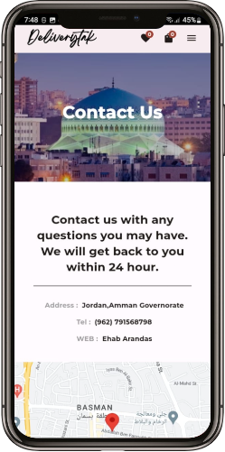

# Deliverytak: Flutter Firebase Fashion Store with Admin Panel

Deliverytak is a Flutter application integrated with Firebase backend services, designed to serve as a fashion store with an intuitive admin panel. It allows users to browse through a variety of fashion items, add them to their cart, and make purchases seamlessly. Additionally, it empowers administrators to manage product listings, orders, and user data efficiently.

## Features

- **User Interface:**
    - Sleek and user-friendly interface designed with Flutter for a seamless user experience.
    - Intuitive navigation allowing users to effortlessly browse through various fashion items.
- **Authentication:**
    - Firebase Authentication integration for secure user authentication and authorization.
    - Users can sign up, log in, and reset their passwords securely.
- **Product Management:**
    - Admin panel for managing fashion products, including adding new products, updating existing ones, and removing items as necessary.
- **Shopping Cart:**
    - Users can add products to their shopping cart and proceed to checkout easily.
    - Cart management functionalities such as adding, removing, or updating the quantity of items.
- **Orders:**
    - Users can view their order history, including details such as order date, items purchased, and total cost.
    - Admins can monitor incoming orders, mark them as processed, and track order fulfillment.
- **Real-time Database:**
    - Firebase Realtime Database integration for seamless data synchronization across devices.
    - Instant updates on product availability, stock levels, and order status.
- **Notifications:**
    - Push notifications to keep users informed about order confirmations, shipment updates, and promotional offers.
- **Responsive Design:**
    - Responsive UI design ensuring optimal user experience across various screen sizes and orientations.
- **Analytics and Insights:**
    - Utilize Firebase Analytics to gain valuable insights into user behavior, popular products, and sales trends.
- **Scalability and Reliability:**
    - Leveraging Firebase backend services ensures scalability and reliability, allowing the application to handle increased user loads seamlessly.

## Technologies Used

- **Flutter:** A cross-platform UI toolkit for building natively compiled applications for mobile, web, and desktop from a single codebase.
- **Firebase:**
    - Firebase Authentication: For user authentication and authorization.
    - Firebase Realtime Database: For storing and synchronizing data in real time.
    - Firebase Cloud Messaging: For sending push notifications to users.
    - Firebase Analytics: For tracking user engagement and behavior.
- **Dart:** The programming language used for building Flutter applications.

## Getting Started

To run the DeliveryTak application locally, follow these steps:

1. Clone this repository to your local machine.
2. Set up Firebase for the project by creating a new Firebase project on the [Firebase Console](https://console.firebase.google.com/) and adding the necessary configuration files to the Flutter project.
3. Ensure you have Flutter installed on your machine. If not, refer to the [Flutter documentation](https://flutter.dev/docs/get-started/install) for installation instructions.
4. Run `flutter pub get` to install the dependencies.
5. Run the app using `flutter run`.

For detailed instructions on setting up Firebase for a Flutter project, refer to the [Firebase Flutter documentation](https://firebase.flutter.dev/docs/overview).

## Contributing

Contributions to DeliveryTak are welcomed and encouraged! If you find any issues or have suggestions for improvements, please feel free to open an issue or submit a pull request.

## License

DeliveryTak is open-source software licensed under the [MIT License](LICENSE).

## Disclaimer

DeliveryTak is a fictional project created for demonstration purposes only. It is not associated with any real business or entity.

## APK

## Screenshots

    *Client Interface*

    *Admin Interface*